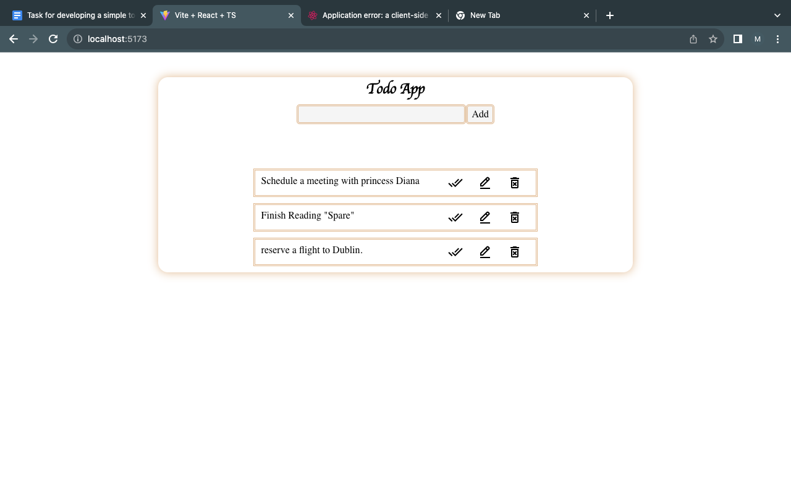
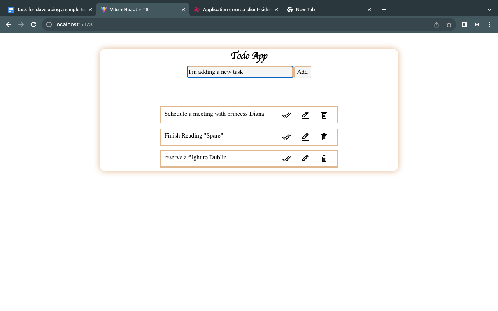
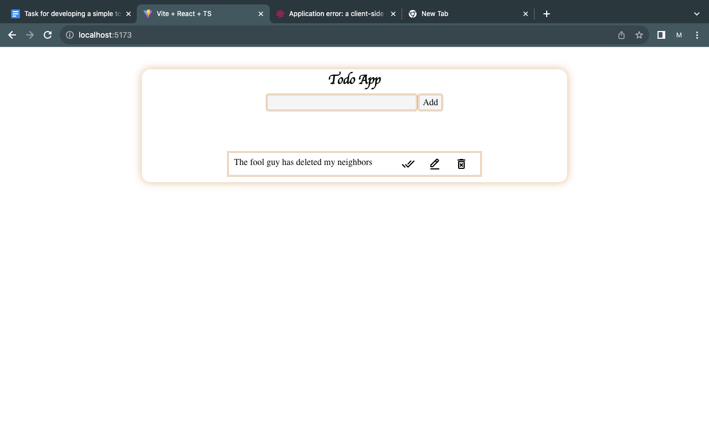

## Running the project

- clone the repo

```bash
git clone <repo-url>
```

- Install dependencies

```bash
cd <repo-name>
npm install
```

- Run the app

```bash
npm run dev
```

## Screenshots

### List of Todos



<br>

### Add Todo

<br>

<br>


<br>

### Delete Todo

<br>

<br>

### Edit Todo

<br>


```

```
